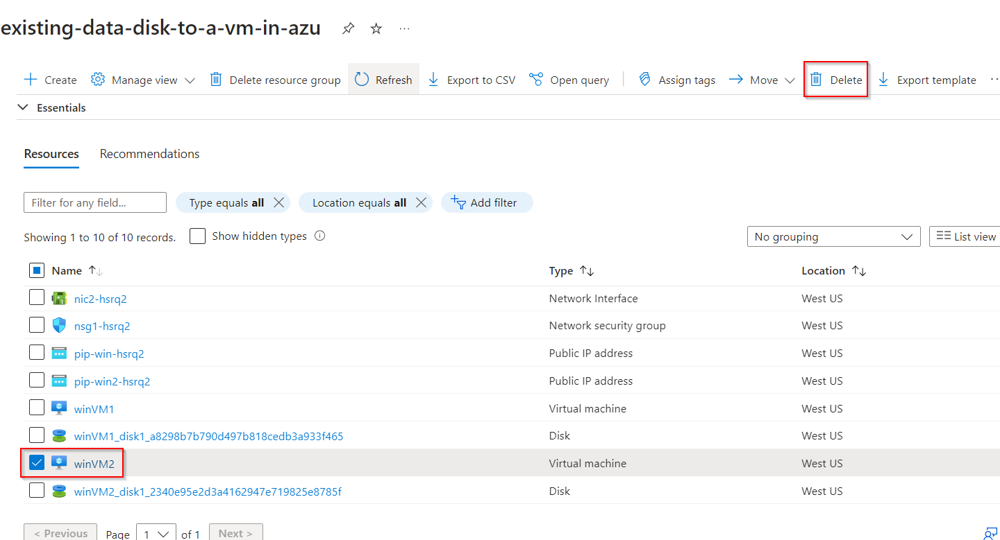
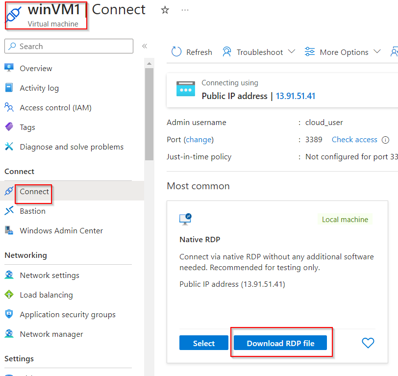
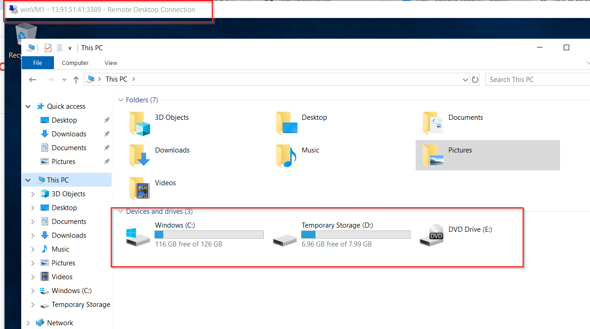
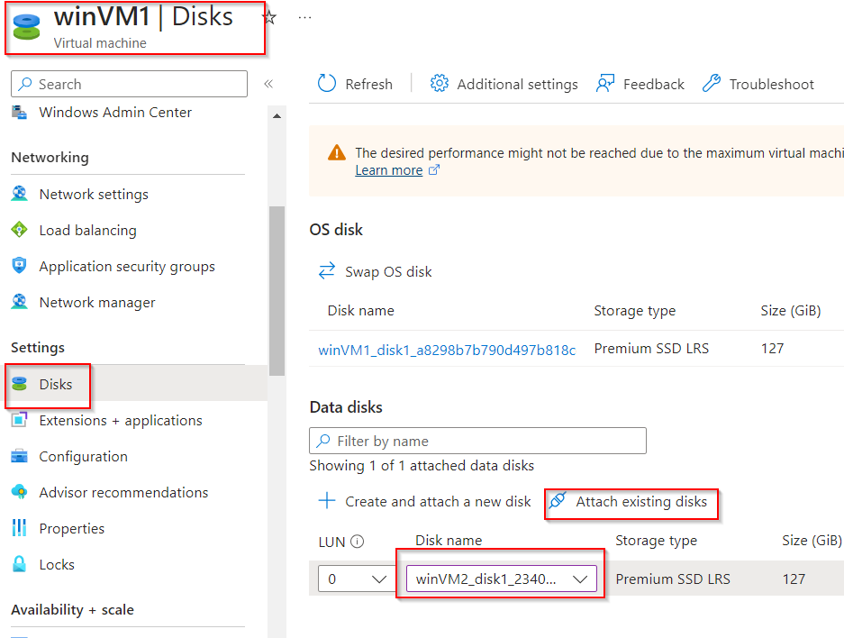
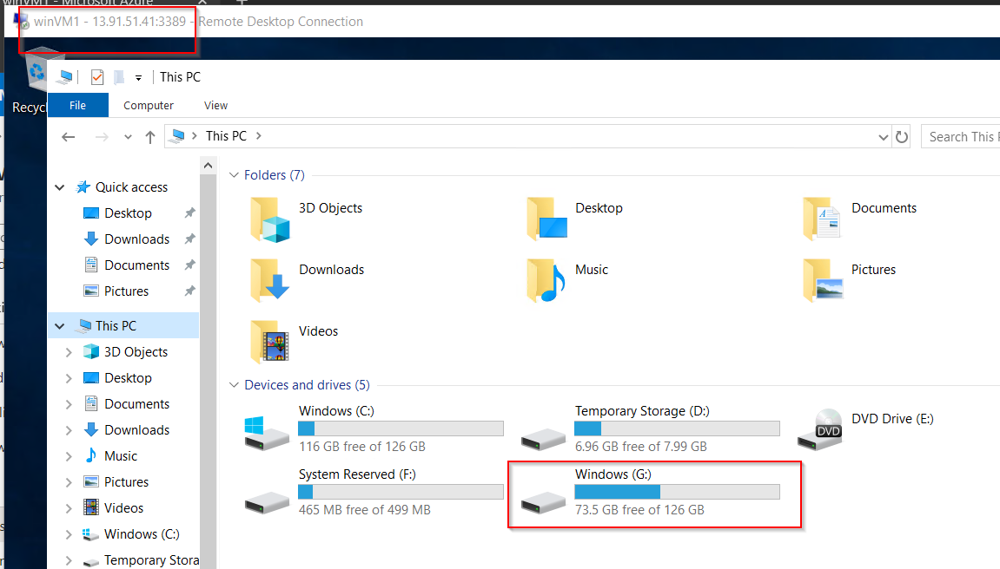

# Add Existing Data Disk to a VM in Azure

**There are 3 objectives with this lab:**
* Decommission WinVM2 and Retain the Storage
* Attach Existing WinVM2 Data Disk to WinVM1
* Verify Disk on WinVM1

## Decommission WinVM2 and Retain the Storage

In the first part of the lab, we need to completely destroy the virtual machine (VM) named `winVM2`. Make sure you only delete the VM and not the additional resources that are created when you create the VM. We need the disk. So highlight the VM and click delete at the top of the page. Follow the prompt and it should be gone!

Easy peazy. On to the next part of the lab. 

## Attach Existing WinVM2 Data Disk to WinVM1

For the second portion of this lab, we need to add the data disk from `winVM2` to `winVM1` but before we do that, I want us to RDP into `winVM1` to confirm that we have only its data disk and not the data disk from `winVM2`.

Click on `winVM1` and on the left hand side, go to Connect > Connect. Download the RDP file using the button on this page. 

Once the file is downloaded, click on it and you should be prompted for a password. Use the password that A Cloud Guru (ACG) has provided in the lab. When everything loads up, navigate to File Explorer and click This PC. You should only see a C: drive and a few another storage drives that are typical of any computer. Make a note of this. 

Lets navigate back to the portal. We'll select `winVM1` and on the left hand side side, go to Settings > Disks. You should be presented with a Data disks section and at the bottom of this page, choose `Attach existing disks`. Then choose the data disk from `winVM2`. This should add the disk to `winVM1`.

That completes the second objective. Lets move to the final objective. 

## Verify Disk on WinVM1

The last task is to verify that data disk 2 has been added. So navigate back to the RDP session for `winVM1`. Refresh the File Explorer page and you should see a new G: drive! This is the drive from `winVM2`.

Lab completed!

## Personal Notes

Easy lab. This one was also very short so that was a bonus!

